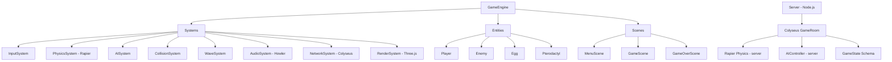

# 3D Joust Game — Development Plan

> Stack decisions and technology evaluation live in [tech-stack.md](tech-stack.md) and [technical-assessment.md](technical-assessment.md).

---

## Game Vision

A complete, polished 3D remake of the 1982 Atari Joust arcade game — fully playable in the browser, with local and online multiplayer, escalating AI waves, and a visual/audio experience that honors the original while fully embracing 3D.

**Target scope:** Single-player with AI waves → Local 2-player split-screen → Online multiplayer up to 4 players → Leaderboard and match history.

---

## Original Joust Mechanics (Canonical Reference)

Based on the classic 1982 Atari game:

- **Players**: 1–2 players riding ostriches (player) or buzzards (enemies).
- **Objective**: Collide with opponents. Higher altitude at time of collision wins; the loser transforms into an egg.
- **Collision Rules**:
  - Higher player wins → lower player becomes an egg.
  - Equal altitude → both become eggs (simultaneous joust).
  - Winning player scores points; egg can then be collected for bonus points.
- **Flight Mechanics**: Flapping wings adds upward velocity. Gravity is constant. Sustained altitude requires continuous flapping.
- **Hazards**:
  - Lava pit at the bottom: instant death.
  - Pterodactyl: appears in later waves, unkillable until open-mouthed (original rule).
  - Buzzard riders resurrect if their egg is not collected quickly.
- **Waves**: Progressive difficulty — more enemies, faster enemies, special enemy types.
- **Scoring**: Points for kills, egg collection, wave survival bonus.
- **Lives**: Finite lives; game over when depleted.

---

## 3D Adaptations

| Original | 3D Adaptation |
|----------|--------------|
| 2D flat arena | 3D arena with depth; platforms extend into Z-axis |
| Side-scroll view | Follow camera with optional first-person mode |
| 8-direction movement | Full WASD + mouse or gamepad stick |
| Fixed platform positions | Procedurally varied platforms per wave (later) |
| 2 players max | Up to 4 online players |
| No spatial audio | Positional audio per entity |
| Pixel sprites | Low-poly GLTF models with skeletal animation |

---

## Architecture

```
GameEngine
├── Systems (run in order each frame)
│   ├── InputSystem          keyboard / gamepad / touch
│   ├── PhysicsSystem        Rapier world step + mesh sync
│   ├── AISystem             enemy state machines
│   ├── CollisionSystem      altitude wins, egg triggers, lava
│   ├── WaveSystem           spawning, difficulty curves
│   ├── AudioSystem          Howler.js positional sounds
│   ├── NetworkSystem        Colyseus room sync
│   └── RenderSystem         Three.js scene update + camera
├── Entities
│   ├── Player               local or remote; GLTF model + physics body
│   ├── Enemy                AI-controlled; state: patrol / chase / evade
│   ├── Egg                  physics body; countdown to hatch
│   └── Pterodactyl          special enemy; immune except during open-mouth window
├── Scenes
│   ├── BootScene            asset preloading
│   ├── MenuScene            main menu, lobby
│   ├── GameScene            main gameplay
│   └── GameOverScene        results, leaderboard entry
└── Managers
    ├── AssetManager         GLTF, texture, audio preloading with progress
    ├── SceneManager         scene transitions
    └── SaveManager          localStorage high scores
```

---

## Current Status

### Phase 0 — Complete ✅
- [x] Vite dev server configured
- [x] Three.js scene with camera, lights, renderer
- [x] Lava pit ground mesh + animated point light
- [x] 6 platforms (PLATFORMS constant in types.ts)
- [x] Arena boundary walls
- [x] Rider base class with geometry (cylinder body, sphere head, beak, wings, legs, lance)
- [x] Wing flap animation (sine wave, timed reset)
- [x] Gravity + platform collision (manual AABB via PhysicsSystem)
- [x] WASD + Arrow key movement, Spacebar flap (diagonal normalised)
- [x] Enemy AI — patrol / chase / evade state machine (AISystem)
- [x] Altitude-based collision resolution (CollisionSystem)
- [x] Egg spawning, physics, collection, enemy respawn (Egg entity)
- [x] Score / Lives (♥ hearts) / Wave HUD
- [x] Wave-clear banner and Game Over screen with Play Again
- [x] TypeScript — strict mode, zero type errors
- [x] Modular architecture: entities/, systems/, scenes/, GameEngine
- [x] InputSystem centralised (no scattered window listeners)
- [x] WaveSystem with 8-wave config table and grace period
- [x] AudioSystem scaffold (Howler wired, fails silently until audio files added)
- [x] .gitignore and README

### Known Issues (active)
- [ ] Rapier installed but PhysicsSystem still uses manual AABB — Phase 1
- [ ] No GLTF models — using procedural geometry — Phase 2 (tech debt)
- [ ] No audio files — AudioSystem wired but silent — Phase 4 (tech debt)
- [ ] No main menu or pause screen — Phase 6
- [ ] No local or online multiplayer — Phases 7–8

---

## Implementation Roadmap

### Phase 0 — Stabilize & Migrate (Foundation) ✅ COMPLETE
*Goal: Clean, typed, bug-free base before building on top of it.*

- [x] **0.1** Fix the `enemy` scoping bug in lava collision check
- [x] **0.2** Fix wave system — enemies must respawn; wave increments only when all are defeated
- [x] **0.3** Fix lives system — lose a life on enemy collision loss, not just lava
- [x] **0.4** Add TypeScript (`tsconfig.json`, rename `.js` → `.ts`, fix type errors)
- [x] **0.5** Add ESLint + Prettier config
- [x] **0.6** Restructure `src/` into `entities/`, `systems/`, `scenes/`, `managers/`
- [x] **0.7** Extract game loop from `main.ts` into a `GameEngine` class
- [x] **0.8** Create `InputSystem` — centralize all key/mouse state
- [x] **0.9** Create `AssetManager` — preload assets with loading screen

**Exit criteria**: No runtime errors, TypeScript compiles clean, game loop modular. ✅

---

### Phase 1 — Physics Integration
*Goal: Replace manual AABB physics with Rapier for accurate, deterministic simulation.*

- [x] **1.1** Install `@dimforge/rapier3d-compat`, uninstall `cannon-es`
- [x] **1.2** Create `PhysicsSystem` — Rapier world init, fixed timestep loop, body-to-mesh sync
- [x] **1.3** Add rigid bodies to Player and Enemy (capsule colliders)
- [x] **1.4** Add static colliders to platforms and lava boundary (solid floor + platform cuboids)
- [x] **1.5** Tune gravity constant and flap force to match original Joust feel
- [x] **1.6** Add angular damping + lockRotations so riders don't spin uncontrollably
- [x] **1.7** Platform edge friction (2.0) acts as edge magnet
- [x] **1.8** Lava kill zone: position check at LAVA_Y after each step

**Exit criteria**: All physics run through Rapier; manual `velocityY` code removed. ✅

---

### Phase 2 — GLTF Models & Animation
*Goal: Replace placeholder geometry with proper 3D models and skeletal animations.*

- [ ] **2.1** Find or create low-poly ostrich + buzzard GLTF models (Sketchfab / Blender)
- [ ] **2.2** Compress models with `gltf-transform` (target: < 500 KB per model)
- [ ] **2.3** Load models via `GLTFLoader` in `AssetManager`
- [ ] **2.4** Attach physics capsule collider to loaded model's root
- [ ] **2.5** Map animations: `idle`, `flap`, `walk`, `death`, `hatch` (AnimationMixer)
- [ ] **2.6** Implement `AnimationStateMachine` class: transitions between states
- [ ] **2.7** Implement wing-flap animation tied to flap input (blend flap → glide)
- [ ] **2.8** Implement egg model + hatch animation
- [ ] **2.9** Add lance/joust prop to player model
- [ ] **2.10** Player color customization (vertex color or material swap per player slot)

**Exit criteria**: Game runs with GLTF models; no visible geometry primitives.

---

### Phase 3 — Arena & Visual Polish ✅ COMPLETE
*Goal: A complete, visually compelling arena that reads well in 3D.*

- [x] **3.1** Design arena layout: platform positions, boundary pillars, stalagmites/stalactites
- [x] **3.2** Procedural cave geometry (pillars, stalagmites, stalactites) — GLTF deferred to TD-01
- [x] **3.3** Lava material: animated GLSL fbm shader (5-octave fractal noise, 4-stop colour ramp)
- [x] **3.4** ParticleSystem: lava bubbles (continuous), death burst, egg-collect burst, joust-win flash
- [x] **3.5** Skydome: cave gradient shader (black ceiling → dark cave → lava-red base)
- [x] **3.6** Platform materials: MeshStandardMaterial + lava-glow trim strip on underside
- [x] **3.7** Animated lava point light (drifting position, flickering intensity)
- [x] **3.8** Post-processing: UnrealBloomPass (strength 0.55, threshold 0.72) via EffectComposer
- [x] **3.9** Death particle burst on player and enemy death
- [x] **3.10** FloatingText: billboarded canvas sprites (+10, +5) with additive blend fade-out

**Exit criteria**: Arena looks polished and readable; lava is clearly dangerous. ✅

---

### Phase 4 — Audio
*Goal: Full audio atmosphere matching the original's arcade energy.*

- [x] **4.1** Install Howler.js + AudioSystem scaffold (fails silently until files added)
- [ ] **4.2** Gather/record/synthesize sound assets: *(tech debt — external dependency)*
  - Wing flap (player and enemy, slightly different pitch)
  - Joust collision impact
  - Egg pop / crack
  - Egg collect
  - Player death
  - Lava splash
  - Wave start fanfare
  - Wave clear jingle
  - Pterodactyl screech
  - Background loop music (chiptune or orchestral)
- [ ] **4.3** Create `AudioSystem` with Howler sound sprite file
- [ ] **4.4** Add positional audio to enemies (flap sounds come from enemy position)
- [ ] **4.5** Music layer system: intensity increases with wave number
- [ ] **4.6** Mute/volume controls in settings menu

**Exit criteria**: All major game events have sound; audio is spatial.

---

### Phase 5 — AI & Wave System ✅ COMPLETE
*Goal: Progressively challenging AI enemies that feel like the original.*

- [x] **5.1** AISystem with 4-state machine: `PATROL → CHASE → EVADE → ATTACK`
- [x] **5.2** Patrol: fly random waypoints; flap to maintain target altitude
- [x] **5.3** Chase: move toward player, flap for altitude advantage
- [x] **5.4** Evade: flee horizontally + flap aggressively when player is above
- [x] **5.5** Attack: enemy above player → accelerated dive, auto-pull-up after 2s
- [x] **5.6** Enemy types with per-type speed, flapChance, aggroRange, reactionTime, colour:
  - **Bounder** (red) — slow, wide reaction time, low aggro range
  - **Hunter** (purple, fin badge) — 1.3× speed, doubles flapChance, 16u aggro
  - **Shadow** (teal, twin horns, 12% larger) — 1.7× speed, 2.8× flapChance, attacks immediately
- [x] **5.7** WaveSystem with 12-wave config table; staggered spawn queue (delay per enemy); typed enemy slots; pterodactyl flag per wave; grace period
- [x] **5.8** Pterodactyl entity: figure-8 flight path, animated jaw, 1.5s vulnerable window every 6s cycle, +250 score, removed on kill
- [x] **5.9** Difficulty scaling: speed, flapChance, aggroRange, reactionTime all tighten per wave; Shadow enemies dominate waves 8+
- [x] **Combo system**: consecutive kills within 4s grant +5 per chain; combo label shown in FloatingText

**Exit criteria**: 10+ wave progression with escalating challenge; pterodactyl appears and is defeatable. ✅

---

### Phase 6 — UI & HUD
*Goal: Complete in-game UI and menu system.*

- [ ] **6.1** Main menu: logo, Play, Multiplayer, Settings, Leaderboard
- [ ] **6.2** HUD: score, lives (icon-based), wave indicator, combo multiplier
- [ ] **6.3** Minimap (top-right): 2D overhead view showing all entity positions
- [ ] **6.4** Wave start overlay: "WAVE X" banner with enemy type preview
- [ ] **6.5** Game over screen: final score, high score comparison, Play Again / Menu
- [ ] **6.6** Pause menu: resume, settings, quit
- [ ] **6.7** Settings menu: volume sliders, graphics quality, controls remapping
- [ ] **6.8** LocalStorage save: high score, settings persistence
- [ ] **6.9** Floating score text on kills ("+10", "+5 BONUS") — billboarded in 3D space

**Exit criteria**: All menus functional; HUD reads clearly during intense gameplay.

---

### Phase 7 — Local Multiplayer
*Goal: Two players on the same keyboard or with gamepads.*

- [ ] **7.1** Add `GamepadSystem` — map gamepad axes/buttons, hot-plug support
- [ ] **7.2** Player 2 keyboard layout (WASD + Q for flap, or configurable)
- [ ] **7.3** Split-screen camera: two `WebGLRenderer` viewports, or PiP style
- [ ] **7.4** Player 2 entity spawned at opposite start position
- [ ] **7.5** Friendly fire rules: Player 1 vs Player 2 same collision rules as vs AI
- [ ] **7.6** Score tracking per player; winner screen at game over

**Exit criteria**: Two players can compete locally on one machine.

---

### Phase 8 — Online Multiplayer
*Goal: Real-time online play for 2–4 players.*

- [ ] **8.1** Install Colyseus server + client
- [ ] **8.2** Define Colyseus schema: `PlayerState`, `EggState`, `GameState`
- [ ] **8.3** Server-side game loop: Rapier physics runs on server (authoritative)
- [ ] **8.4** Client sends input; server applies and broadcasts state delta
- [ ] **8.5** Client-side interpolation: smooth remote player positions between server ticks
- [ ] **8.6** Client-side prediction: apply local input immediately, reconcile on server update
- [ ] **8.7** Lobby system: create room / join by code / public matchmaking
- [ ] **8.8** Player name input and color selection in lobby
- [ ] **8.9** Disconnect handling: replace disconnected player with AI temporarily
- [ ] **8.10** Latency display in HUD (ping indicator)
- [ ] **8.11** Deploy server to Railway; configure WebSocket endpoint in Vercel env

**Exit criteria**: Four remote players can complete a game session without desync.

---

### Phase 9 — Power-ups & Extra Mechanics
*Goal: Deepen gameplay with optional power-ups and bonus mechanics.*

- [ ] **9.1** Power-up spawning system: items appear on platforms periodically
- [ ] **9.2** Power-up types:
  - **Speed Boost** — faster lateral movement for 10s
  - **Gravity Well** — reduces gravity for 10s (easier altitude control)
  - **Shield** — survive one losing collision without dying
  - **Score Multiplier** — x2 points for 15s
  - **Haste** — increased flap frequency cap for 8s
- [ ] **9.3** Visual indicator on player when power-up is active (glow, particle aura)
- [ ] **9.4** Bonus round: "Egg Wave" — all enemies become eggs that must be collected before time runs out
- [ ] **9.5** Hidden combo system: consecutive kills without touching ground = streak bonus

**Exit criteria**: At least 3 power-up types spawning and functional; bonus round triggers.

---

### Phase 10 — Performance & Polish
*Goal: Stable 60 FPS on mid-range hardware; production-ready build.*

- [ ] **10.1** GPU instancing for eggs (InstancedMesh) — many eggs, one draw call
- [ ] **10.2** Frustum culling audit — ensure off-screen objects are not processed
- [ ] **10.3** LOD (Level of Detail) on player/enemy models — simplified mesh at distance
- [ ] **10.4** Texture atlasing — combine platform/prop textures
- [ ] **10.5** Stats panel in dev mode (`stats.js`) — monitor FPS, draw calls, memory
- [ ] **10.6** Asset preloading with progress bar (all GLTF + audio before game starts)
- [ ] **10.7** Mobile support: touch controls (on-screen joystick + flap button)
- [ ] **10.8** PWA manifest + service worker — installable, offline menu
- [ ] **10.9** Accessibility: colorblind mode (distinct player shapes, not just colors)
- [ ] **10.10** Error boundary: uncaught errors show "reload game" screen, not blank page

**Exit criteria**: 60 FPS on a 2020 mid-range laptop; Lighthouse performance score > 85.

---

### Phase 11 — Leaderboard & Persistence
*Goal: Global high scores and player identity.*

- [ ] **11.1** Global leaderboard API (simple Node.js + SQLite or Supabase)
- [ ] **11.2** Score submission after game over (name + score + wave reached)
- [ ] **11.3** Leaderboard display: top 10 all-time, top 10 this week
- [ ] **11.4** Local high score always shown even without network
- [ ] **11.5** Optional: OAuth login (GitHub/Google) for persistent identity

---

## Potential Challenges and Solutions

| Challenge | Solution |
|-----------|----------|
| Physics-render drift | Fixed-timestep Rapier loop + render interpolation |
| Multiplayer desync | Rapier determinism + server-authoritative state |
| GLTF model loading time | Compress with gltf-transform; show loading bar |
| Altitude comparison in 3D | Use Rapier body Y-position; tie-break with velocity |
| Camera occlusion by platforms | Raycast from player to camera; zoom in if blocked |
| Enemy AI "dumb" in 3D | Add vertical pathfinding; prefer platform-level movement |
| Mobile performance | Reduce shadow resolution; disable bloom on low-end |
| WebSocket firewall blocks | Colyseus falls back to long-polling via Socket.io |

---

## Architecture Diagram



---

## File Structure (Target)

```
Joust Game 3D/
├── index.html
├── vite.config.ts
├── tsconfig.json
├── package.json
├── plan.md
├── tech-stack.md
├── technical-assessment.md
├── src/
│   ├── main.ts                  game entry, mounts GameEngine
│   ├── GameEngine.ts            main loop, system orchestration
│   ├── entities/
│   │   ├── Player.ts
│   │   ├── Enemy.ts
│   │   ├── Egg.ts
│   │   └── Pterodactyl.ts
│   ├── systems/
│   │   ├── InputSystem.ts
│   │   ├── PhysicsSystem.ts
│   │   ├── AISystem.ts
│   │   ├── CollisionSystem.ts
│   │   ├── WaveSystem.ts
│   │   ├── AudioSystem.ts
│   │   ├── NetworkSystem.ts
│   │   └── RenderSystem.ts
│   ├── scenes/
│   │   ├── BootScene.ts
│   │   ├── MenuScene.ts
│   │   ├── GameScene.ts
│   │   └── GameOverScene.ts
│   ├── managers/
│   │   ├── AssetManager.ts
│   │   ├── SceneManager.ts
│   │   └── SaveManager.ts
│   └── ui/
│       ├── HUD.ts
│       ├── Minimap.ts
│       └── FloatingText.ts
├── assets/
│   ├── models/                  .glb files
│   ├── textures/                .webp / .ktx2 files
│   └── audio/                   .mp3 / .ogg sprite files
└── server/
    ├── index.ts
    ├── GameRoom.ts
    ├── GameState.ts
    └── AIController.ts
```

---

## Milestone Summary

| Milestone | Phase | Key Deliverable |
|-----------|-------|----------------|
| **M0 – Stable Base** | 0 | Bug-free, TypeScript, modular architecture |
| **M1 – Real Physics** | 1 | Rapier integrated, feels like Joust |
| **M2 – Visual Joust** | 2–3 | GLTF models, arena, lava effects |
| **M3 – Full Arcade** | 4–5 | Audio + 10-wave AI progression |
| **M4 – Complete Solo** | 6 | All menus, HUD, saves |
| **M5 – Local Co-op** | 7 | 2-player same machine |
| **M6 – Online** | 8 | 4-player networked game |
| **M7 – Extra Content** | 9–11 | Power-ups, leaderboard, polish |
